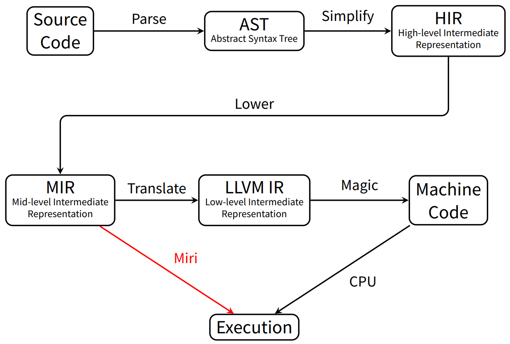
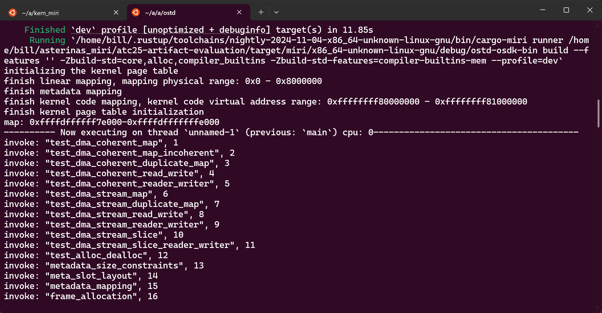
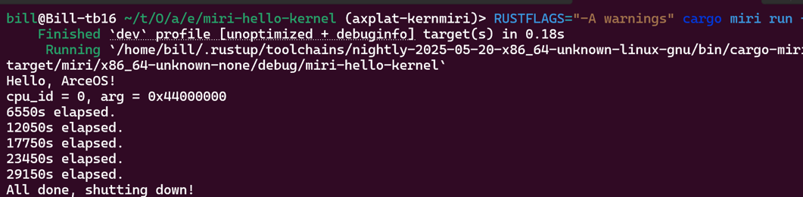

# KernMiri 尝试集成报告

罗绍玮 2022010749

## 1. 引言

本项目一开始旨在能让 OS-checker 能集成 KernMiri。然而在尝试和学习的过程中发现由於 Miri 对工具链版本依赖的特殊性，KernMiri 並不能直接泛用在所有 rust code 的环境下。因此我主要的重心放在了试图让 KernMiri 更泛用以及适配 ArceOS 的方面上。

本项目最终的结果是：

- 修改了 KernMiri 的内存布局，使得其能在星绽论文版本上完成检测。
- 在上述基础上，升级了 KernMiri 工具链。现在有一个星绽当前主线的工具链版本以及 ArceOS 的工具版本。
- 为 axplat 实现 KernMiri 的架构 Mitch，起了个头。现在能运行最简单的 hello-kernel 但内存相关的部分仍需时间尝试。

## 2. KernMiri

仓库链接：https://github.com/billlosw/kern_miri/tree/KernMiri-2025-05-20

### 2.1 动机

Rust 语言的安全性保证依赖于编译器检查，但在 unsafe 区块中，这些保证失效。 Miri 作为 Rust 的官方未定义行为 (UB) 检测工具，能够通过解释执行 MIR (Mid-level Intermediate Representation) 来动态检查内存越界、悬空指针等错误 。



然而，标准 Miri 并不具备直接运行操作系统内核 (Kernel) 的能力，主要原因在于：

- 内存模型不匹配： Miri 使用抽象的 AllocId 来管理内存，地址仅为抽象数字，与真实硬体的物理地址无关。而内核代码充斥着对特定物理内存地址的直接操作 。

- 缺乏硬体模拟： Miri 无法理解 MMIO (Memory-Mapped I/O) 或特权指令，也不支持内联汇编 (Inline Assembly)，这使得依赖底层硬体交互的内核代码无法执行 。

KernMiri 是 Miri 的一个**扩展**分支，旨在解决上述问题。它引入了 PhysicalMemory 结构来模拟真实的物理内存条，并通过 PageTable 模拟 MMU 行为，允许内核管理物理页的状态 (Unused， Typed) 。同时，它通过 Shims 机制将硬体操作转发为 Miri 可理解的 Rust 代码 。

### 2.2 运行机制

KernMiri 的核心运行机制是基于 Miri 的解释器架构进行扩展，通过引入虚拟架构和物理内存模拟层，使其能够以 "Bare-metal" 的形式运行操作系统内核。

#### 2.2.1 MIR 解释与 InterpCx

与传统编译生成二进制机器码不同，Miri（以及 KernMiri）通过解释器直接执行 MIR (Mid-level Intermediate Representation)。
* InterpCx: `rustc` 生成 MIR 后，Miri 使用 `create_ecx` 函数创建一个 `InterpCx`。这是执行 MIR 的核心组件。
* MiriMachine: `InterpCx` 依赖 `MiriMachine` 结构体来定义解释器的具体行为和能力。

执行过程遵循“读取-检查-执行”的循环：
1.  `InterpCx` 读取一条 MIR 指令（例如内存写入 `*ptr = value`）。
2.  在执行前，调用 `MiriMachine` 对应的 Hook（钩子函数），例如 `before_memory_write`。
3.  Hook 检查： `MiriMachine` 执行所有安全检查，包括 Borrow Checking（借用检查）、Data Race Detection（数据竞争检测）和 Alignment Check（对齐检查）。
4.  如果检查通过，`InterpCx` 才会执行实际的内存操作。

#### 2.2.2 Mitch 虚拟架构

为了让 Miri 能够运行依赖硬件特性的内核代码，KernMiri 定义了一个极简的伪 CPU 架构 —— **Mitch**。这样，只需要 OS 能支持 Mitch 这个架构，那就能让该 OS 在 KernMiri 上跑起来进行检查了。
* 指令集： Mitch 直接以 Rust 的 MIR 作为其指令集。
* 页表支持： 既然模拟了 CPU，Mitch 架构定义了硬件属性，包括支持 3 级或 4 级分页系统。这使得操作系统可以像在真实 CPU 上一样设置启动页表（如 Linear Mapping）。

#### 2.2.3 物理内存模拟

这是 KernMiri 与标准 Miri 最大的区别。标准 Miri 使用抽象的 `AllocId` 图来管理内存，与物理硬件或虚拟内存布局无关。 KernMiri 扩展了这一模型：
* PhysicalMemory 结构： 引入了 `PhysicalMemory` 结构体来模拟真实的 RAM。
* 页状态追踪： 通过 `PageState` 追踪每个物理页的状态（如 `Unused`， `Typed`， `PageTable` 等），从而在硬件层面强制执行内存安全。
* 桥接机制： 操作系统通过 KernMiri 提供的 Shims（如 `kern_miri_alloc_pages`）在指定的物理地址上创建 Miri 的 Allocation。这样既保留了 Miri 对 Allocation 的 UB 检测能力，又实现了 OS 对物理页的精细管理。

但需要注意的是，当前 KernMiri 中的页表设置的 fixed 的，后续可能需要考虑为其设计 config 或者是 shims 让其可以支持更多的配置。

#### 2.2.4 Shims 与 Hooks

由于 Miri 无法执行 C 语言库函数或内联汇编，且被解释程序无法直接访问宿主机 OS，KernMiri 利用 Shims 和 Hooks 模拟硬件交互。
* Shims ：模拟特权指令和硬件操作。例如，当内核需要分配物理页或获取时间 Tick 时，会调用 `kern_miri_alloc_pages` 或 `kern_miri_get_ticks` 等 Shims，这些 Shims 由 Rust std 实现并直接操作 KernMiri 的模拟硬件层。
* Hooks ：KernMiri 修改了 Miri 的标准 Hooks 以适应内核环境。 
* 内存写入检查： 在 `before_memory_write` 中，KernMiri 增加了对页表的检查。如果被写入的内存属于页表，会设置 `pt_checker` 标志，通知机器页表项 (PTE) 已被修改。 

### 2.3 局限性

尽管 KernMiri 能在不需要真实硬件的情况下对操作系统内核进行内存安全检查，但其作为 Miri 的扩展工具，仍存在以下核心局限性：

-  KernMiri 继承了 Miri 的解释器特性，无法理解或解释执行机器码和内联汇编 (Inline Assembly)。因此，开发者必须为这些汇编操作手动编写 Rust 实现的 Shims 才能通过检查。这意味着 KernMiri **无法检测原始汇编代码中的 Bug**，只能验证被 Shim 替换后的逻辑流和内存操作。
- 缺乏外设模拟与硬件交互能力，凡是**依赖设备交互的测试用例均无法在 KernMiri 环境下运行**。这限制了其在驱动程序验证和全系统集成测试中的应用范围，使其更专注于核心内核逻辑（如内存分配、调度算法）的检查。

### 2.4 工具链依赖

然而，KernMiri 严重依赖于 Rust 编译器内部的 `InterpCx` 接口，这导致它与特定的 `rustc` 版本高度绑定。

Rust 编译器的编译流程是从 AST 到 HIR，再到 MIR，最后生成 LLVM IR。在当前版本中，HIR 和 MIR 之间还存在 Typed HIR。 `InterpCx` 本质上是编译器为了进行编译时函数评估 (Compile-Time Function Evaluation, CTFE) 而设计的内部组件。

Miri（以及 KernMiri）正是复用了这个解释器，通过重写和实现 `interpret::machine` 中的 trait 来在 MIR 解释过程中跟踪信息并执行 UB 检查。然而，由于 Rust 编译器更新频繁，生成的 MIR 格式以及 `interpret` 模块的内部 API 并不稳定，这使得 Miri 必须随着编译器版本的变化而不断调整适配，导致了工具链的强耦合。

为了使 KernMiri 能够通用化并支持所有 Rust 工具链，一个稳定的 MIR 解释器至关重要。但目前的调研显示，这样的解释器尚不存在：

* Stable-MIR: Rust 官方提供了 `project-stable-mir`，旨在帮助 Kani 等静态分析工具专注于分析方法而非应对 `rustc` 的变动。但该项目目前仅提供稳定的 MIR 信息，并**未提供对应的解释器**。
* Charon: 这是一个将 MIR 转换为 LLBC (Low-Level Borrow Calculus) 和 ULLBC 格式的工具，实际上是 AST 和 MIR 的清理版本。虽然 Kani 采用了它进行分析工作，且理论上可以通过为 ULLBC 编写解释器来实现解耦，但这需要额外的开发工作，目前并没有现成的解决方案。

因此，在缺乏稳定 MIR 解释器的现状下，KernMiri 只能通过绑定特定的 Nightly 版本来利用 `rustc` 内部不稳定的解释器接口。

### 2.5 使用方法

#### 2.5.1 安装

1. 获取源码
   克隆 KernMiri 的特定分支（例如 `KernMiri-2024-11-04`）：

    ```shell
    git clone --single-branch -b KernMiri-2024-11-04 git@github.com:billlosw/kern_miri.git kern_miri
    cd kern_miri
    ```

2. 配置 Rust 环境
   安装并覆盖当前目录的 Rust 工具链版本：

    ```shell
    rustup install nightly-2024-11-04
    rustup override set nightly-2024-11-04
    # 安装必要的组件
    rustup component add cargo rust-src rustc-dev llvm-tools rustfmt clippy
    ```

3. 编译与安装
   运行安装脚本：

   > 注意：不要运行 `./miri toolchain`，因为这会报错，Rust 只保留特定时期内的编译产物，必须手动安装工具链。 

    ```shell
    ./miri install
    ```

4. 验证与环境变量
   检查 Miri 版本，确保 Commit Hash 与 `kern_miri.git` 的分支一致：

    ```shell
    cargo miri --version
    ```

	如果系统找不到 miri 命令，需要手动将编译产物添加到 PATH 中：

    ```shell
    # Bash
    export PATH=$PATH:$HOME/.rustup/toolchains/nightly-2024-11-04-x86_64-unknown-linux-gnu/bin
    # Fish Shell
    set -gx PATH $PATH $HOME/.rustup/toolchains/nightly-2024-11-04-x86_64-unknown-linux-gnu/bin
    ```

#### 2.5.2 运行

##### 2.5.2.1 运行 Asterinas (星绽)

1. 获取适配版代码
   克隆适配了 Miri 的 Asterinas 分支：

    ```shell
    git clone --single-branch -b miri_asterinas \
    https://github.com/asterinas/atc25-artifact-evaluation.git miri_asterinas
    cd miri_asterinas
    ```

2. 修改源代码
   使用全局搜索替换功能修改以下不兼容代码：

   - 将所有 `kern_miri_copy` 替换为 `kern_miri_copy_untyped`。

   - 将所有 `ActionChoice::Miri => todo!()` 替换为 `ActionChoice::Miri => return Ok(())`。

3. 执行解释
   设置环境并运行：

    ```shell
    rustup override set nightly-2024-11-04
    make install_osdk
    mkdir -p test/build && touch test/build/initramfs.cpio.gz
    cd ostd
    # 启动 Miri 解释器运行 Kernel
    RUSTFLAGS="-A warnings" \
    MIRIFLAGS="-Zmiri-disable-stacked-borrows -Zmiri-ignore-leaks" cargo osdk miri run
    ```

如果前面步骤没有问题，那么应该就能看到解释运行过程中测试到的函数以及所记录的时间相关的信息。



##### 2.5.2.2运行其他 Kernel (ArceOS)

要让 KernMiri 运行其他内核，关键在于添加一个 `miri_start` 入口点。

1. 定义入口函数
   在 `src/main.rs` 中添加以下代码作为 Miri 的入口：

    ```rust
    #![no_std]
    #![no_main]
    extern crate axplat_kernmiri; // 假设你的适配层 crate 名称
   
    // Miri 的专属入口点
    #[unsafe(no_mangle)]
    fn miri_start(_argc: isize, _argv: *const *const u8) -> isize {
    	// 手动调用原本的 main 函数，并传入参数 (例如模拟的 cpu_id 和 dtb 地址)
   	 main(0, 0x44000000);
    }
   
    #[axplat::main]
    fn main(cpu_id: usize, arg: usize) -> ! {
        axplat::console_println!("Hello, ArceOS!");
        // ... 内核逻辑
        axplat::power::system_off();
    }
    ```

2. 执行命令		
   在项目目录下运行：

    ```shell
    RUSTFLAGS="-A warnings" cargo miri run --target x86_64-unknown-none
    ```

#### 2.5.3 工具链升级

由于 Miri 使用内置于 Rust 编译器（更新频繁）的解释器，它只能运行在与 Miri 使用相同工具链版本的代码上。升级过程本质上是将官方 Miri 的特定 Commit 合并到 KernMiri 中。

升级流程示例 (从 2025-02-01 升级到 2025-05-20)：

1.  进入目录并添加上游远端：

```shell
cd kern_miri
git remote add upstream git@github.com:rust-lang/miri.git
```

2.  切换到旧版本分支：

```shell
git checkout KernMiri-2025-02-01
```

3.  寻找并合并目标 Commit：
你需要去 Miri 的官方仓库寻找与目标工具链日期匹配的 Pull Request。例如，对于 `nightly-2025-05-20`，找到对应的 Commit hash (如 `f9e968...`)。 

```shell
git merge f9e968e3c69c2aa878ff98ee046b5933d62b6bd2
```

4.  解决冲突与编译：
解决 git merge 产生的冲突和随后的编译器报错。完成后重新安装：

```shell
rustup override set nightly-2025-05-20
./miri install
```

#### 2.5.4 提供更多 Shims <a id="2-5-4"></a>

KernMiri 无法解释内联汇编。对于读取寄存器等硬体操作（如获取时间），必须通过 Shim 机制用 Rust 代码模拟。

1. 在 KernMiri 内部实现逻辑
   修改 `src/shims/foreign_items.rs` 中的 `emulate_foreign_item_inner` 函数，添加新的匹配项：

    ```rust
    	// 示例：模拟获取硬件time tick
        "kern_miri_get_ticks" => {
        // 1. 检查调用约定和参数
        let [] = this.check_shim(abi, Conv::Rust, link_name, args)?;
        // 2. 获取宿主机单调时钟并计算纳秒
        let duration = this.machine.monotonic_clock.now().duration_since(this.machine.monotonic_clock.epoch());
        let ticks = u64::try_from(duration.as_nanos()).map_err(|_| {
        err_unsup_format!("programs running longer than 2^64 nanoseconds are not supported")
        })?;
        // 3. 将结果写入返回值
        this.write_scalar(Scalar::from_u64(ticks), dest)?;
    }
    ```

2. 在用户侧调用
   在内核代码中，定义外部符号并调用该 Shim，替代原有的汇编实现：

    ```rust
    unsafe extern "Rust" {
    	fn kern_miri_get_ticks() -> u64;
    }
   
    fn current_ticks() -> u64 {
   	 // 替换原本的汇编读取操作 (如 time::read())
    	unsafe { kern_miri_get_ticks() }
    }
    ```

## 3. Axplat-KernMiri

仓库链接：https://github.com/billlosw/axplat_crates/tree/axplat-kernmiri

### 3.1 动机

KernMiri 的本质是定义了一个名为 **Mitch** 的新虚拟架构 。 ArceOS 之所以能够在多种 CPU 架构上运行，归功于其硬体抽象层 axplat 带来的解耦能力 。因此，理论上只需要针对 KernMiri（即 Mitch 架构）实作 axplat 中定义的接口，并对入口函数进行微调，就应当能够让 ArceOS 在 KernMiri 上运行 。

### 3.2 测例

为了更好验证 axplat 实现的正确性，新创建了一个 `hello-kernel-mem` 的东西，其主要是测试 mem 的接口效果是否正确。具体就是用 `axalloc::global_init` 初始化后，对堆进行操作 (Box, Vec)。在我电脑上 hello-kernel-mem 在 x86_64 和 riscv64 是能正常通过的。

### 3.3 核心接口实现

#### 3.3.1 Console 和 Time

控制台的实现相对直接，通过调用 KernMiri 环境下的 `miri_write_to_stdout` 即可将字节流输出到宿主机的终端。

时钟的实现则较为特殊。由于 KernMiri 不模拟具体的硬件寄存器，无法像 RISC-V 或 x86 那样直接读取硬件计数器。解决方案是在 KernMiri 的 `src/shims/foreign_items.rs` 中注册一个新的 Shim `kern_miri_get_ticks`。该 Shim 通过 Rust 标准库获取宿主机的单调时钟 (Monotonic Clock) 并转换为纳秒返回。在 `axplat/time.rs` 中，通过 FFI 调用此 Shim 来模拟硬件 Tick。

详见 [2.5.4](#2-5-4)。

#### 3.3.2 内存布局配置

内存布局的配置主要参考了 `miri_asterinas` 项目以及 KernMiri 自身的物理内存定义：

```rust
/// |<----------------------------Kernel Code Section-------------------------------->|
/// |<-Boot PT->|<-Kernel Static Section->|<-Kernel Stack Section->|<-CPU-local Section->|
/// |-----------|-------------------------|------------------------|---------------------|
/// 0x0      0x1_0000                 0x40_0000                0xff_0000             0x100_0000
/// 
/// |<-Kernel Code Section->|<-----Free Pages------>|
/// |-----------------------|-----------------------|
/// 0x0                 0x100_0000             0x800_0000
```

在 `axconfig.toml` 中，`phys-memory-base` 被设置为 `0x100_0000`。这是因为 KernMiri 的内存模型默认将 `0x0` 到 `0x100_0000` 预留给了 Kernel Code Section、Boot PT 等静态段。如果将起始地址设为 `0`，ArceOS 的分配器在初始化时会尝试申请该区域的内存，从而触发 KernMiri 的 UB (Undefined Behavior) 报错。

### 3.4 内存管理与同步原语挑战

在尝试运行更复杂的 `hello-kernel-mem` 测试（涉及堆分配）时，遇到了主要的技术难点。

#### 3.4.1 SpinLock 适配

ArceOS 的 `axalloc` 模块依赖 `kspin` 库，其中的 `SpinNoIrq` 实现使用了内联汇编 (Inline Assembly) 来屏蔽中断操作 (`cli`, `pushf`) ，导致KernMiri 无法解释执行这些汇编指令，导致报错 "inline assembly is not supported"。

为了解决此问题，目前的临时方案是将 Asterinas (星绽) 项目中针对 Miri 适配的锁实现移植过来。该实现使用了 `core::sync::atomic::AtomicBool` 的 `compare_exchange` 方法。猜测因为这是纯 Rust 代码，因此能够被 Miri 正确解释执行，从而绕过了汇编指令的限制。

#### 3.4.2 分配器初始化与指针

在解决了锁的问题后，运行卡在了 `axalloc::init` 阶段。尽管 `palloc` 初始化成功，但在初始化字节分配器时，Miri 报出了 "Dangling pointer (it has no provenance)" 的错误。

```shell
error: Undefined Behavior: memory access failed: attempting to access 8 bytes, but got 0x1000000[noalloc] which is a dangling pointer (it has no provenance)
   --> /home/bill/.cargo/registry/src/index.crates.io-1949cf8c6b5b557f/buddy_system_allocator-0.10.0/src/linked_list.rs:34:9
    |
34  |         *item = self.head as usize;
    |         ^^^^^^^^^^^^^^^^^^^^^^^^^^ memory access failed: attempting to access 8 bytes, but got 0x1000000[noalloc] which is a dangling pointer (it has no provenance)
```

这是因为在那里面有一个 read/write pointer 的操作，而 Miri 严格的指针 Provenance 模型导致了 ArceOS 的 `alloc_pages` 虽然返回了物理地址数值，但并未通过 KernMiri 的 Shims 正确地将该内存区域的所有权“告知”解释器，或者是在将整数地址转换为指针时丢失了 Provenance 信息。目前星绽项目是在 `init` 之后才使用 `(de)alloc` 相关的 Shims，而 ArceOS 在初始化阶段的行为与 KernMiri 的预期尚存差异。

### 3.5 使用方法

先在 2025-05-20 的 KernMiri `./miri install`，然后可以到 `axplat/examples/miri-hello-kernel(-mem)` 中 `RUSTFLAGS="-A warnings" cargo miri run --target x86_64-unknown-none` 执行。

如果在跑 hello-kernel 時出现了类似报错：

```
  rust-lld: error: undefined symbol: __stop_linkme_PAGE_FAULT
  >>> referenced by axcpu.c0d2766388d423b4-cgu.0
  >>>               axcpu-4cc4d8ff5e930c26.axcpu.c0d2766388d423b4-cgu.0.rcgu.o:(axcpu::riscv::trap::handlb
  >>> referenced by axcpu.c0d2766388d423b4-cgu.0
  >>>               axcpu-4cc4d8ff5e930c26.axcpu.c0d2766388d423b4-cgu.0.rcgu.o:(axcpu::trap::PAGE_FAULT::b

  rust-lld: error: undefined symbol: __start_linkm2_IRQ
  >>> referenced by axcpu.c0d2766388d423b4-cgu.0
  >>>               axcpu-4cc4d8ff5e930c26.axcpu.c0d2766388d423b4-cgu.0.rcgu.o:(riscv_trap_handler) in arb
  >>> referenced by axcpu.c0d2766388d423b4-cgu.0
  >>>               axcpu-4cc4d8ff5e930c26.axcpu.c0d2766388d423b4-cgu.0.rcgu.o:(axcpu::trap::IRQ::hb9b8c1b
  >>> the encapsulation symbol needs to be retained under --gc-sections properly; consider -z nostart-sto)
```

那就在目录下的 `build.rs` 改成：

```rust
fn main() {
  let arch = std::env::var("CARGO_CFG_TARGET_ARCH").unwrap();
  gen_linker_script(&arch).unwrap();
  println!("cargo:rustc-link-arg=-no-pie");
  // add these two lines
  println!("cargo:rustc-link-arg=-z");
  println!("cargo:rustc-link-arg=nostart-stop-gc");
}
```

### 3.6 实验结果

目前已取得以下成果：

1. 基础运行成功： 实现了 `axplat` 的基础支持，`miri-hello-kernel` 能够在 `x86_64-unknown-none` 目标下通过 KernMiri 解释运行，并正确输出 "Hello, ArceOS\!" 以及参数信息。

   

2. `miri-hello-kernel-mem` 测试目前无法通过。虽然修复了 SpinLock 的指令集兼容问题，但受限于 Miri 的内存模型，`axalloc` 在初始化堆内存时仍存在 UB 报错，需要进一步修改 `axalloc` 源码以通过 Shims 与 KernMiri 的伪物理内存进行交互。

## 4\. 总结

本项目旨在探索 OS-checker 与 KernMiri 的集成可能性。在项目初期，确认了 KernMiri 因深度依赖编译器内部接口 (`InterpCx`) 而导致的工具链耦合问题。虽然调研了 Stable-MIR 和 Charon 等项目，但发现它们目前仅提供静态分析层面的 MIR 信息，缺乏稳定的解释器实现，无法实现真正的解耦。

基于此，工作重心转向了 KernMiri 的维护与适配扩展：

1.  工具链升级：成功将 KernMiri 的工具链版本升级至 `nightly-2025-02-01` 及 `2025-05-20`，使其与星绽以及ArceOS当前使用的工具链一致 。
2.  ArceOS 适配：验证了通过实现 `axplat` 接口在 KernMiri (Mitch 架构) 上运行 ArceOS 的可行性。目前已完成控制台和时钟的适配，并定位了内存分配器在 Miri 环境下的关键兼容性问题。

后续工作将主要集中在 `axalloc` 的深度改造，使其能够正确调用 KernMiri 的内存管理 Shims，以及完善 Page Table 在 Mitch 架构下的配置支持。

## 5\. 其它

### 文档与代码仓库

- KernMiri: https://github.com/billlosw/kern_miri.git (主要Branch: `KernMiri-2025-05-20`)
- Axplat: https://github.com/billlosw/axplat_crates (Branch: `axplat-kernmiri`) 。

* KernMiri 项目文档与 Shim 列表：详见 KernMiri 仓库下的 `doc/KernMiri.md`。 
* Miri 的学习笔记以及解释器的调研分别在 KernMiri 仓库下的 `doc/miri_note.md` 和 `doc/rust.md`
* Axplat 适配记录与运行指南：详见 `axplat_crates` 仓库下的 `doc/axplat.md`。 

### 开发日志

项目期间的每周详细进展在 KernMiri repo 的 [Discussions](https://github.com/billlosw/kern_miri/discussions/1)中。